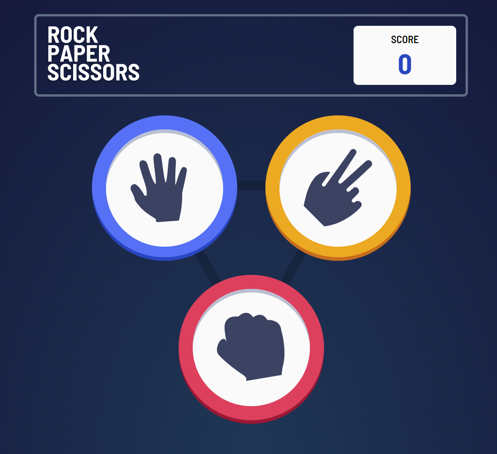
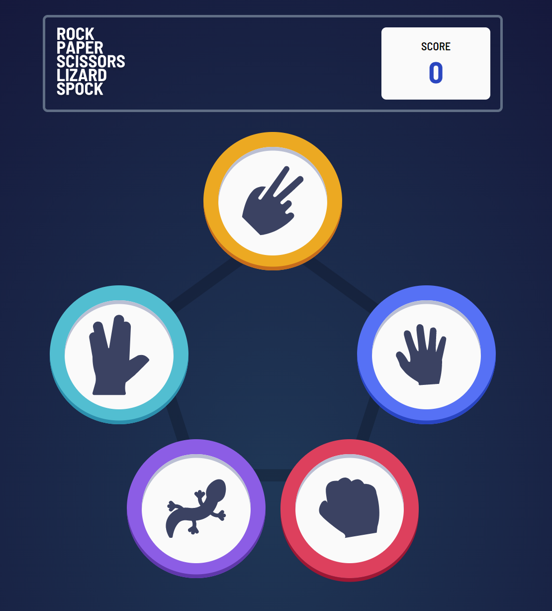

# Frontend Mentor - Rock, Paper, Scissors solution

This is a solution to the [Rock, Paper, Scissors challenge on Frontend Mentor](https://www.frontendmentor.io/challenges/rock-paper-scissors-game-pTgwgvgH). Frontend Mentor challenges help you improve your coding skills by building realistic projects. 

## Table of contents

- [Overview](#overview)
  - [The challenge](#the-challenge)
  - [Screenshot](#screenshot)
  - [Links](#links)
- [My process](#my-process)
  - [Built with](#built-with)
  - [Continued development](#continued-development)
- [Author](#author)

## Overview

### The challenge

Users should be able to:

- View the optimal layout for the game depending on their device's screen size
- Play Rock, Paper, Scissors against the computer
- **Bonus**: Play Rock, Paper, Scissors, Lizard, Spock against the computer

### Screenshot

### Links

- Solution URL: (https://github.com/crolette/rock-paper-scissors-master)
- Live Site URL: (https://crolette.github.io/rock-paper-scissors-master/)

## My process

### Built with

- Semantic HTML5 markup
- CSS custom properties
- Flexbox
- CSS Grid
- Desktop-first workflow
- JS Vanilla

### Continued development

Continue to improve my JS and CSS grid skills.

## Author

- Website - [Crolweb](https://www.crolweb.be)
- Frontend Mentor - [crolette](https://www.frontendmentor.io/profile/crolette)
- Codepen - [crolette](https://codepen.io/crolette/pens/)
- LinkedIn - [Jonathan](https://www.linkedin.com/in/jonathan-de-dijcker-6a7b1532/)
